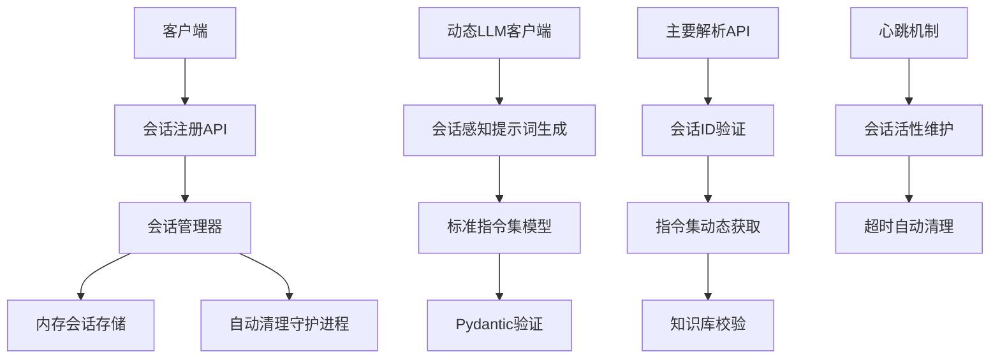

# 动态指令集注册系统实施计划

## 🎯 项目目标

实现一个**真正的动态客户端能力发现系统**，客户端在首次连接时上报自己的指令集，服务端在会话期间动态使用这些指令集。

## 📋 实施阶段规划

### Phase 1: 基础框架搭建 (3-5天)

#### 1.1 标准数据结构实现
- [ ] 创建 `src/models/command_set_models.py`
- [ ] 实现标准指令集Pydantic模型
- [ ] 创建验证工具函数
- [ ] 编写单元测试

#### 1.2 会话管理器开发
- [ ] 创建 `src/session/session_manager.py`
- [ ] 实现 `LightweightSessionManager` 类
- [ ] 添加会话生命周期管理
- [ ] 实现自动清理机制

#### 1.3 API接口开发
- [ ] 创建 `src/api/session_api.py`
- [ ] 实现注册、心跳、注销接口
- [ ] 添加会话操作查询接口
- [ ] 编写API文档和示例

### Phase 2: 核心功能集成 (5-7天)

#### 2.1 动态LLM客户端改造
- [ ] 创建 `src/core/dynamic_llm_client.py`
- [ ] 继承现有LLMClient功能
- [ ] 实现动态提示词生成功能
- [ ] 添加会话感知的指令解析

#### 2.2 主要API集成
- [ ] 修改 `src/api/agent_api.py` 支持会话ID
- [ ] 更新 `CommandGenerator` 支持动态指令集
- [ ] 实现fallback机制（无会话时的默认行为）

#### 2.3 配置和初始化
- [ ] 更新 `config/config.json` 添加会话相关配置
- [ ] 修改启动脚本初始化会话管理器
- [ ] 添加健康检查端点

### Phase 3: 客户端适配和测试 (3-4天)

#### 3.1 客户端SDK开发
- [ ] 创建JavaScript客户端库
- [ ] 实现会话管理功能
- [ ] 添加自动重连机制
- [ ] 编写使用文档

#### 3.2 现有客户端改造
- [ ] 更新Web3D客户端
- [ ] 更新器灵桌面宠物客户端
- [ ] 测试移动端适配
- [ ] 验证API调用者兼容性

#### 3.3 系统测试
- [ ] 单元测试覆盖率 ≥ 85%
- [ ] 集成测试验证完整流程
- [ ] 压力测试会话管理性能
- [ ] 兼容性测试（旧版本客户端）

## 🛠️ 技术实现细节

### 核心组件架构



### 关键技术选型

| 组件 | 技术选择 | 理由 |
|------|----------|------|
| 会话存储 | 纯内存 + threading.Lock | 零依赖，高性能 |
| 数据验证 | Pydantic | 类型安全，自动验证 |
| 并发控制 | RLock | 读写安全 |
| 定时任务 | threading.Timer | 轻量级，无需外部依赖 |
| API框架 | FastAPI | 现有技术栈，无缝集成 |

## 📊 预期收益

### 功能收益
1. **真正的动态能力发现** - 客户端能力实时上报
2. **零配置扩展** - 新客户端无需服务端配置修改
3. **安全性提升** - 最小权限原则，按需暴露能力
4. **灵活性增强** - 客户端可动态调整自己的能力集

### 技术收益
1. **架构解耦** - 客户端和服务端彻底分离
2. **维护简化** - 统一的指令集管理标准
3. **扩展性好** - 支持未来更多客户端类型
4. **性能优化** - 精确的指令集减少LLM负担

## ⚠️ 风险评估与应对

### 高风险项
1. **会话管理内存泄漏**
   - 应对：严格的自动清理机制，内存监控
2. **并发访问安全问题**
   - 应对：完善的锁机制，压力测试验证
3. **向后兼容性问题**
   - 应对：fallback机制，渐进式部署

### 中等风险项
1. **网络不稳定导致会话中断**
   - 应对：心跳重试机制，会话恢复功能
2. **客户端实现差异**
   - 应对：详细的SDK文档，参考实现示例

## 🎯 成功标准

### 技术指标
- [ ] 会话注册成功率 ≥ 99.5%
- [ ] 内存使用增长 ≤ 10MB/1000活跃会话
- [ ] API响应时间增加 ≤ 50ms
- [ ] 单元测试覆盖率 ≥ 85%

### 业务指标
- [ ] 支持动态注册的客户端类型 ≥ 3种
- [ ] 新客户端接入时间 ≤ 2小时
- [ ] 系统稳定性 ≥ 99.9%
- [ ] 用户满意度提升 ≥ 20%

## 📅 时间安排

```
Week 1: Phase 1 基础框架搭建
- Mon-Tue: 标准数据结构实现
- Wed-Thu: 会话管理器开发  
- Fri: API接口开发

Week 2: Phase 2 核心功能集成
- Mon-Wed: 动态LLM客户端改造
- Thu-Fri: 主要API集成

Week 3: Phase 3 客户端适配和测试
- Mon-Tue: 客户端SDK开发
- Wed: 现有客户端改造
- Thu-Fri: 系统测试和优化
```

## 💰 资源需求

### 人力资源
- 后端开发工程师：1人（全职）
- 前端/客户端开发工程师：0.5人（兼职）
- 测试工程师：0.3人（兼职）

### 技术资源
- 开发环境：现有Python/FastAPI环境
- 测试环境：本地Docker容器
- 监控工具：现有日志系统基础上扩展

这个实施计划确保了项目按部就班地推进，同时保持了足够的灵活性来应对可能出现的挑战。