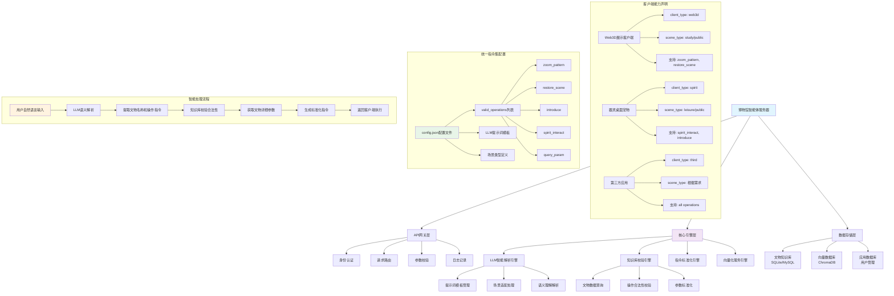

# 博物馆智能体系统架构思维导图



## 🎯 核心工作机制总结

### 1. **MCP-like服务架构**
- 不同客户端 = 不同的"工具能力"
- 服务器 = 统一的"工具调度中心"
- 通过标准化协议实现能力发现和调用

### 2. **三层解耦设计**
```
客户端层(能力声明) 
    ↓
服务管理层(协议转换)
    ↓  
核心引擎层(智能处理)
```

### 3. **动态配置机制**
- 指令集：config.json统一管理
- 客户端能力：请求参数声明
- 场景适配：模板动态调整
- 参数配置：知识库按需加载

### 4. **标准化交互协议**
```json
// 请求格式统一
{
  "user_input": "用户说的话",
  "client_type": "客户端类型",
  "scene_type": "使用场景"
}

// 响应格式统一  
{
  "code": 200,
  "data": {
    "artifact_name": "文物名",
    "operation": "操作指令",
    "operation_params": { /* 客户端特定参数 */ }
  }
}
```

这种设计让您对MCP概念的理解完全正确 - 这就是一个面向文化教育领域的智能服务协调平台！