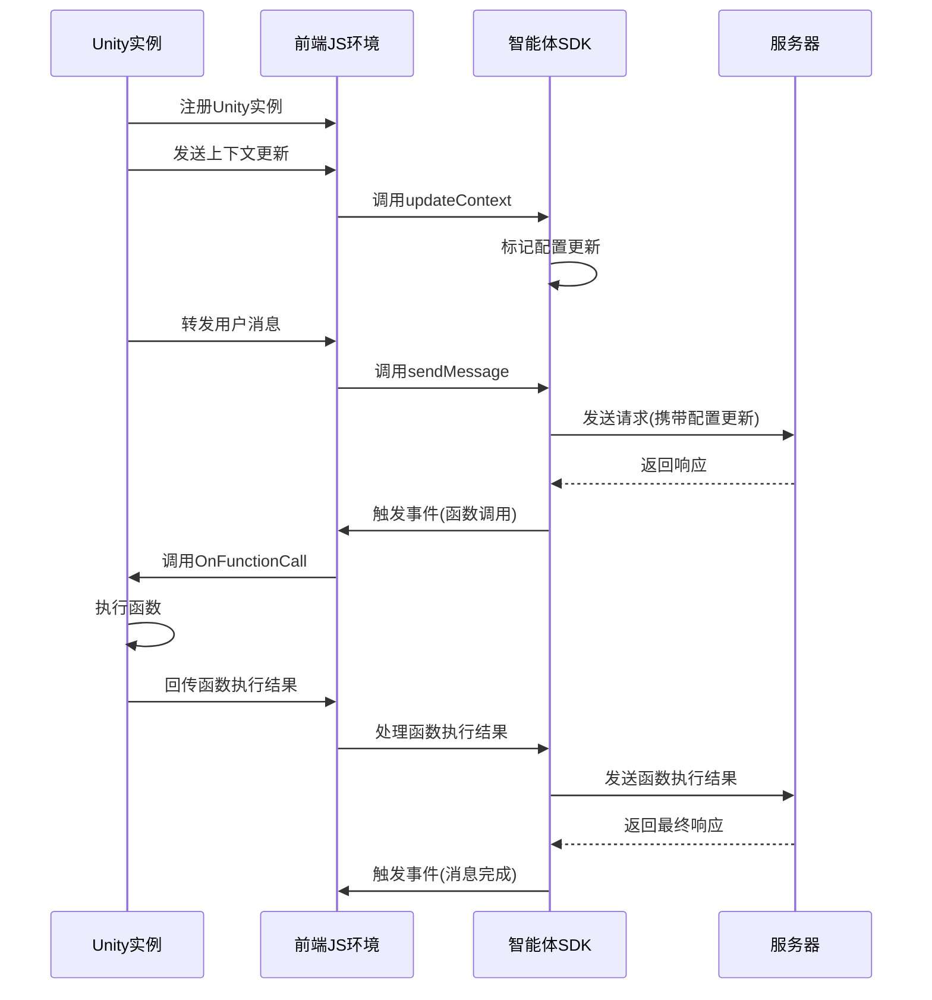

# Unity与前端通信协议

## 重要注意事项

**⚠️ 传输数据的格式和结构必须严格以智能体客户端SDK的要求为准则！**

- 所有从Unity发送到前端的数据必须使用智能体客户端SDK期望的格式
- 数据字段名称必须与SDK定义完全一致（包括大小写）
- 数据结构必须符合SDK的预期，否则可能导致SDK无法正确处理

## 1. 协议概述

本协议定义了Unity实例与前端智能体客户端之间的通信规范，包括数据交换格式、接口定义和工作流程。

### 1.1 适用范围

- Unity WebGL项目与前端智能体客户端的通信
- 智能体上下文数据的传递
- 函数调用与执行结果的交互
- 用户消息的转发

### 1.2 设计原则

- **简单易用**：接口设计简洁明了，便于Unity开发者使用
- **类型安全**：明确的数据结构定义，减少运行时错误
- **可扩展性**：支持未来功能扩展
- **错误处理**：完善的错误处理机制

## 2. 通信架构

### 2.1 架构图



### 2.2 通信层

- **Unity WebGL jslib**：Unity与前端JS环境的底层通信
- **UnityAgentBridge**：前端JS环境中的桥梁对象
- **AgentBridge**：Unity端的桥梁组件

## 3. 数据交换格式

### 3.1 上下文数据格式

**注意：此格式必须严格按照智能体客户端SDK的要求**

```json
{
  "sceneDescription": "场景描述文本",
  "roleDescription": "角色描述文本",
  "responseRequirements": "响应要求文本",
  "functionCalling": [
    {
      "name": "函数名称",
      "description": "函数描述",
      "parameters": {
        "type": "object",
        "properties": {
          "参数名": {
            "type": "参数类型",
            "description": "参数描述"
          }
        },
        "required": ["必选参数名"]
      }
    }
  ],
  "functions": [
    {
      "name": "函数名称",
      "description": "函数描述",
      "parameters": {
        "type": "object",
        "properties": {
          "参数名": {
            "type": "参数类型",
            "description": "参数描述"
          }
        },
        "required": ["必选参数名"]
      }
    }
  ]
}
```

#### 字段说明：
- `sceneDescription`：场景描述文本（智能体客户端SDK直接使用）
- `roleDescription`：角色描述文本（智能体客户端SDK直接使用）
- `responseRequirements`：响应要求文本（智能体客户端SDK直接使用）
- `functionCalling`：函数定义数组（智能体客户端SDK直接使用）
- `functions`：函数定义数组（智能体客户端SDK兼容支持，可作为`functionCalling`的别名）

### 3.2 函数调用格式

```json
{
  "name": "函数名称",
  "parameters": {
    "参数名": "参数值"
  }
}
```

### 3.3 函数执行结果格式

```json
{
  "requestId": "请求ID",
  "functionName": "函数名称",
  "success": true,
  "result": {
    "key": "value"
  },
  "error": null
}
```

## 4. 接口定义

### 4.1 Unity端接口

#### 4.1.1 AgentBridge类

```csharp
public class AgentBridge : MonoBehaviour
{
    // 单例实例
    public static AgentBridge Instance { get; private set; }
    
    // 当前上下文
    public AgentContext currentContext;
    
    // 启动选项
    public bool autoUpdateContext = true;
    
    // 调试输出
    public UnityEngine.UI.Text functionCallOutputText;
    
    // 向前端注册Unity实例
    public void RegisterToJS();
    
    // 接收前端的函数调用
    public void OnFunctionCall(string functionCallJson);
    
    // 向前端发送上下文更新（自动计算差异）
    public void UpdateContext();
    
    // 向前端回传函数执行结果
    public void NotifyFunctionExecuteResult(string resultJson);
    
    // 向前端转发用户消息
    public void ForwardUserMessage(string message);
    
    // 切换上下文组件
    public void SwitchContext(AgentContext newContext);
    
    // 发送用户消息
    public void SendUserMessage(string message);
}
```

#### 4.1.2 AgentContext类

```csharp
[System.Serializable]
public class AgentContext : MonoBehaviour
{
    public string sceneDescription;
    public string roleDescription;
    public string responseRequirements;
    public FunctionDefinition functionDefinition;
}
```

#### 4.1.3 FunctionDefinition类

```csharp
[System.Serializable]
public class FunctionDefinition : MonoBehaviour
{
    public List<FunctionInfo> functions;
    
    public void HandleFunctionCall(string functionCallJson);
}

[System.Serializable]
public class FunctionInfo
{
    public string name;
    public string description;
    public string parameters;
}
```

### 4.2 前端接口

#### 4.2.1 UnityAgentBridge对象

```javascript
const UnityAgentBridge = {
    // 注册Unity实例到JS环境
    registerUnityInstance: function(gameObjectName) {},
    
    // 接收Unity发送的上下文更新
    updateContext: function(contextJson) {},
    
    // 接收Unity回传的函数执行结果
    notifyFunctionResult: function(resultJson) {},
    
    // 接收Unity转发的用户消息
    forwardUserMessage: function(message) {}
};
```

#### 4.2.2 智能体SDK接口

```javascript
// 更新上下文
client.updateContext(contextData);

// 发送消息
client.sendMessage(message);

// 事件监听
client.on('functionCall', function(functionCall) {
    // 处理函数调用
});
```

## 5. 工作流程

### 5.1 初始化流程

1. **Unity启动**：Unity WebGL项目加载完成
2. **注册实例**：Unity调用`RegisterToJS()`方法向前端注册
3. **初始化SDK**：前端初始化智能体SDK
4. **激活上下文**：Unity自动激活初始上下文

### 5.2 上下文更新流程

**注意：数据格式必须严格按照智能体客户端SDK的要求**

1. **Unity更新上下文**：修改`AgentContext`组件的属性
2. **序列化数据**：将上下文数据序列化为JSON字符串，必须使用智能体客户端SDK要求的格式
3. **发送更新**：调用`UpdateContext()`方法发送到前端
4. **前端处理**：`UnityAgentBridge.updateContext()`接收并解析数据
5. **SDK更新**：调用`client.updateContext()`更新智能体上下文
6. **标记更新**：SDK自动标记需要更新的配置项
7. **保存配置**：SDK自动将配置保存到本地存储

### 5.3 用户消息流程

1. **Unity转发消息**：调用`ForwardUserMessage()`方法转发用户消息
2. **前端处理**：`UnityAgentBridge.forwardUserMessage()`接收消息
3. **SDK发送**：调用`client.sendMessage()`发送消息
4. **携带更新**：SDK自动携带标记的配置更新
5. **服务器响应**：服务器返回响应
6. **前端处理**：SDK触发相应事件

### 5.4 函数调用流程

1. **服务器请求**：服务器返回包含函数调用的响应
2. **SDK触发事件**：SDK触发`functionCall`事件
3. **前端处理**：调用Unity的`OnFunctionCall`方法
4. **Unity执行函数**：`FunctionDefinition`组件处理函数调用
5. **回传结果**：Unity调用`NotifyFunctionExecuteResult()`回传执行结果
6. **前端处理**：`UnityAgentBridge.notifyFunctionResult()`接收结果
7. **SDK处理**：SDK处理函数执行结果并发送到服务器
8. **最终响应**：服务器返回最终响应

## 6. 错误处理

### 6.1 Unity端错误处理

- **异常捕获**：所有与前端通信的方法都应包含try-catch块
- **日志输出**：使用`Log.Print()`输出错误信息
- **错误状态**：保持错误状态，便于调试

### 6.2 前端错误处理

- **异常捕获**：所有Unity消息处理都应包含try-catch块
- **错误日志**：使用`console.error()`输出错误信息
- **降级处理**：在SDK未初始化时提供降级处理

### 6.3 常见错误

| 错误类型 | 可能原因 | 解决方案 |
|---------|---------|--------|
| JSON解析失败 | 数据格式不正确 | 确保发送有效的JSON格式数据 |
| SDK未初始化 | 前端加载顺序问题 | 确保SDK初始化完成后再发送消息 |
| 函数不存在 | 函数名称错误 | 检查函数名称是否正确 |
| 参数错误 | 参数类型或数量不匹配 | 确保参数符合函数定义 |

## 7. 最佳实践

### 7.1 Unity开发建议

1. **使用单例模式**：AgentBridge组件应使用单例模式，便于全局访问
2. **模块化设计**：将上下文、函数定义等分离为独立组件
3. **预序列化**：在发送大量数据前预序列化，减少运行时开销
4. **错误处理**：完善的错误处理，提高应用稳定性
5. **性能优化**：避免频繁发送大量数据，合理使用批处理

### 7.2 前端开发建议

1. **事件驱动**：使用事件驱动架构，减少直接依赖
2. **状态管理**：合理管理SDK状态，避免重复初始化
3. **错误边界**：为Unity消息处理添加错误边界
4. **性能监控**：监控通信性能，优化数据传输

### 7.3 测试建议

1. **单元测试**：测试各组件的单独功能
2. **集成测试**：测试完整的通信流程
3. **边界测试**：测试异常情况和边界值
4. **性能测试**：测试大数据量下的通信性能

## 8. 版本历史

| 版本 | 日期 | 变更内容 |
|------|------|----------|
| 1.0 | 2026-02-24 | 初始版本，定义基本通信协议 |
