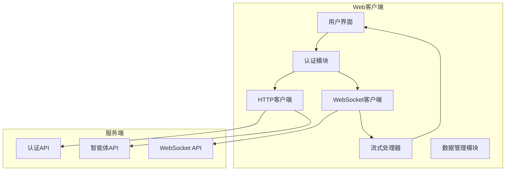
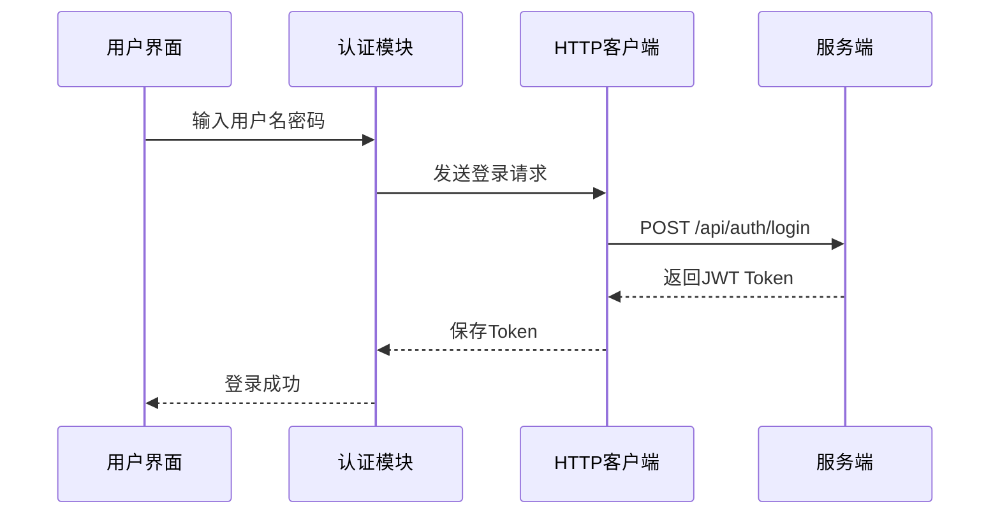
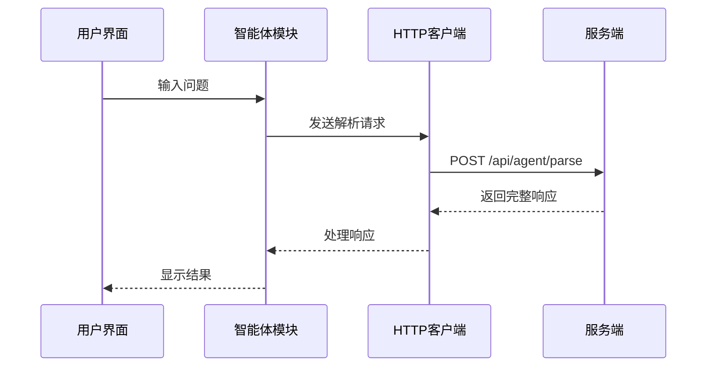
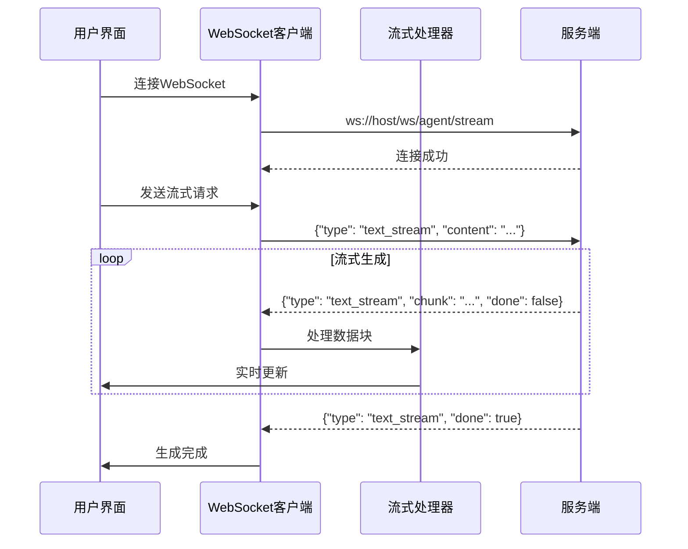
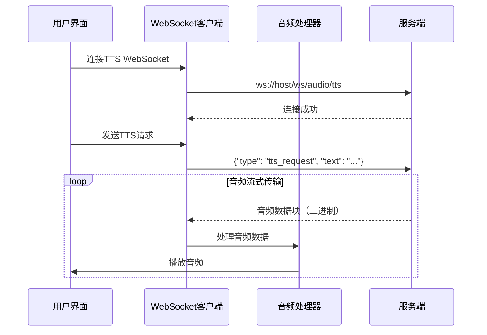
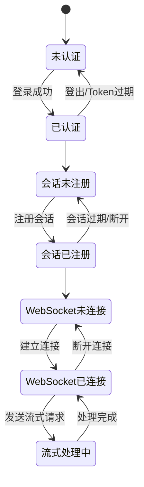

# MuseumAgent Web客户端架构文档

## 概述

MuseumAgent Web客户端是一个基于原生JavaScript开发的博物馆智能体客户端，采用HTTPS REST API和WebSocket混合协议与服务端通信，支持文字对话、语音对话、流式传输等多种交互方式。

---

## 架构设计

### 整体架构



### 分层架构

#### 1. 表示层（UI层）
- **职责**: 负责用户界面展示和用户交互
- **组件**: HTML页面、CSS样式、DOM操作
- **特点**: 响应式设计，支持多终端访问

#### 2. 业务逻辑层
- **职责**: 处理客户端核心业务逻辑
- **组件**:
  - 认证管理
  - 会话管理
  - 消息处理
  - 事件管理

#### 3. 通信层
- **职责**: 负责与服务端的网络通信
- **组件**:
  - HTTP客户端（REST API）
  - WebSocket客户端（实时通信）
  - 连接管理器

#### 4. 数据层
- **职责**: 管理客户端数据和状态
- **组件**:
  - Token管理
  - 会话状态管理
  - WebSocket连接管理

---

## 核心模块

### 1. 认证模块（AuthModule）

**功能**:
- 用户登录/登出
- Token管理
- 用户信息获取

**核心方法**:
```javascript
async login(username, password)
async getCurrentUser()
async logout()
```

**工作流程**:
1. 用户输入用户名和密码
2. 调用`login()`方法发送登录请求
3. 接收JWT Token并保存
4. 后续请求携带Token进行认证

---

### 2. 会话管理模块（SessionManager）

**功能**:
- 会话注册
- 会话验证
- 会话断开

**核心方法**:
```javascript
async registerSession(options)
async validateSession(sessionId)
async disconnectSession(sessionId)
```

**工作流程**:
1. 登录成功后注册会话
2. 获取会话ID
3. 定期验证会话有效性
4. 退出时主动断开会话

---

### 3. HTTP客户端（HTTPClient）

**功能**:
- 发送HTTP请求
- 处理HTTP响应
- 错误处理

**核心方法**:
```javascript
async _httpRequest(endpoint, method, data)
async parseAgent(userInput, options)
```

**特点**:
- 支持GET、POST、PUT、DELETE等方法
- 自动添加认证头
- 统一错误处理
- 超时控制

---

### 4. WebSocket客户端（WebSocketClient）

**功能**:
- 建立WebSocket连接
- 发送/接收消息
- 连接管理
- 心跳机制

**核心方法**:
```javascript
async connectAgentStream(options)
async connectAudioTTS(options)
async sendTextStream(ws, text, onChunk, onComplete)
async sendTTSRequest(ws, text, onAudioChunk)
async sendHeartbeat(ws)
```

**特点**:
- 自动重连机制
- 心跳保活
- 连接状态管理
- 二进制数据支持

---

### 5. 流式处理器（StreamProcessor）

**功能**:
- 处理流式数据
- 数据块组装
- 实时更新UI

**核心方法**:
```javascript
processTextChunk(chunk)
processAudioChunk(chunk)
onStreamComplete(data)
```

**特点**:
- 实时处理数据块
- 支持文本和音频流
- 渐进式UI更新

---

### 6. 事件管理器（EventManager）

**功能**:
- 事件注册/注销
- 事件触发
- 事件监听

**核心方法**:
```javascript
on(event, handler)
off(event, handler)
_emit(event, data)
```

**支持的事件**:
- `login`: 登录成功
- `error`: 发生错误
- `session_registered`: 会话注册成功
- `session_disconnected`: 会话断开
- `agent_response`: 收到智能体响应
- `ws_connected`: WebSocket连接成功
- `ws_disconnected`: WebSocket连接断开
- `stream_chunk`: 收到流式数据块
- `stream_complete`: 流式生成完成
- `audio_chunk`: 收到音频数据块

---

## 通信协议

### HTTPS REST API

**适用场景**:
- 用户认证
- 会话管理
- 间断式对话
- 配置管理

**请求格式**:
```http
POST /api/agent/parse HTTP/1.1
Host: localhost:8000
Authorization: Bearer {token}
Content-Type: application/json

{
  "user_input": "请介绍一下青铜鼎",
  "client_type": "web",
  "scene_type": "public"
}
```

**响应格式**:
```json
{
  "code": 200,
  "msg": "请求处理成功",
  "data": {
    "operation": "query",
    "artifact_name": "青铜鼎",
    "response": "这是一件商周时期的青铜鼎..."
  }
}
```

---

### WebSocket API

**适用场景**:
- 流式对话
- 语音合成（TTS）
- 实时状态推送
- 长文本生成

**连接格式**:
```
ws://host/ws/agent/stream?token={token}
```

**消息格式**:
```json
{
  "type": "text_stream",
  "session_id": "uuid",
  "content": "用户输入",
  "stream_id": "uuid"
}
```

**流式响应**:
```json
{
  "type": "text_stream",
  "stream_id": "uuid",
  "chunk": "生成的文本片段",
  "done": false
}
```

---

## 数据流

### 认证流程



---

### 间断式对话流程



---

### 流式对话流程



---

### 音频TTS流程



---

## 状态管理

### 客户端状态

```javascript
{
  // 认证状态
  isAuthenticated: boolean,
  token: string | null,
  
  // 会话状态
  sessionId: string | null,
  sessionValid: boolean,
  
  // WebSocket连接状态
  wsConnections: {
    agent_stream: WebSocket | null,
    audio_tts: WebSocket | null
  },
  
  // 流式处理状态
  streamBuffer: string,
  audioBuffer: ArrayBuffer[]
}
```

### 状态转换



---

## 错误处理

### 错误类型

1. **网络错误**
   - 连接超时
   - 网络中断
   - DNS解析失败

2. **认证错误**
   - Token无效
   - Token过期
   - 权限不足

3. **业务错误**
   - 会话不存在
   - 参数错误
   - 服务端处理失败

4. **WebSocket错误**
   - 连接失败
   - 连接断开
   - 消息格式错误

### 错误处理策略

```javascript
client.on('error', (data) => {
  switch (data.type) {
    case 'login':
      handleLoginError(data.error);
      break;
    case 'ws_connect':
      handleWebSocketError(data.error);
      break;
    case 'stream':
      handleStreamError(data.error);
      break;
    default:
      handleGenericError(data.error);
  }
});
```

---

## 性能优化

### 1. 连接复用
- WebSocket连接保持持久化
- 避免频繁建立/断开连接

### 2. 数据缓存
- Token本地缓存
- 会话状态缓存
- 响应数据缓存

### 3. 流式处理
- 实时处理数据块
- 渐进式UI更新
- 避免等待完整响应

### 4. 心跳机制
- 定期发送心跳保持连接
- 检测连接状态
- 自动重连

### 5. 资源清理
- 及时断开不用的连接
- 清理事件监听器
- 释放内存资源

---

## 安全性

### 1. 认证安全
- 使用JWT Token认证
- Token定期刷新
- 安全存储Token

### 2. 通信安全
- 使用HTTPS加密传输
- WebSocket支持WSS
- 验证服务端证书

### 3. 数据安全
- 敏感数据加密
- 不在客户端存储密码
- 定期清理缓存

---

## 扩展性

### 1. 插化架构
- 模块化设计
- 事件驱动
- 易于扩展新功能

### 2. 多协议支持
- 支持HTTP和WebSocket
- 易于添加新协议
- 统一的接口设计

### 3. 多终端适配
- 响应式设计
- 移动端优化
- 跨平台支持

---

## 部署说明

### 环境要求
- 现代浏览器（Chrome、Firefox、Safari、Edge）
- JavaScript ES6+支持
- WebSocket支持

### 部署步骤
1. 复制客户端文件到Web服务器
2. 配置服务端URL
3. 启动Web服务器
4. 访问Demo页面测试

### 配置项
```javascript
const config = {
  baseUrl: 'http://localhost:8000',  // 服务端URL
  timeout: 30000,                      // 超时时间
  autoReconnect: true,                 // 自动重连
  reconnectInterval: 5000,              // 重连间隔
  heartbeatInterval: 30000              // 心跳间隔
};
```

---

## 版本历史

| 版本 | 日期 | 说明 |
|------|------|------|
| 1.0.0 | 2026-02-12 | 初始版本，支持HTTPS REST API和WebSocket混合协议 |

---

## 技术支持

如有问题，请联系技术支持团队或查看项目文档。
